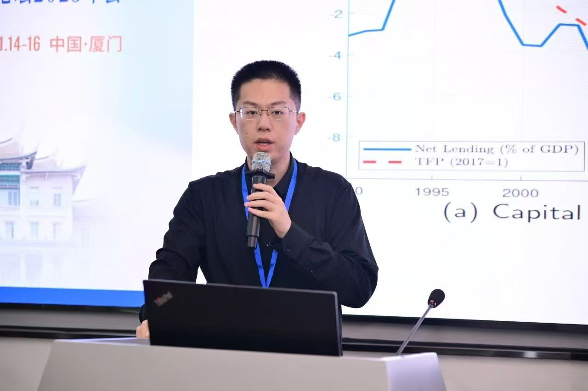

::::: hero-grid
::: hero-photo
{.profile-photo}
:::

::: hero-text
# Haoning Sun

**Ph.D. Candidate in Economics**\
School of Economics and Management, Tsinghua University

I am a Ph.D. candidate in Economics at Tsinghua University. My research interests include **macroeconomics**, **artificial intelligence and the digital economy**, **asset bubbles**, **production networks**, and the **green transition**.

**I will be on the 2026-2027 job market.**

[Email](mailto:sunhn22@mails.tsinghua.edu.cn){.btn .btn-primary} [CV](files/CV_HN.pdf){.btn .btn-outline-primary}
:::
:::::

## Job Market Paper

### Common AI Information and Capital Allocation

This paper studies how common reliance on AI-generated financial information affects information aggregation and real capital allocation. Institutional managers with greater common reliance on AI-extractable information subsequently hold more similar portfolios, while endogenous reliance on a shared AI signal can make aggregate productivity respond non-monotonically to lower AI costs and greater model accuracy.

<details class="abstract-details">

<summary>Full abstract</summary>

This paper studies how AI-generated financial information affects real capital allocation. Investors choose between private research and an AI signal with a shared model error, and firms learn from equilibrium asset prices before investing. Motivating evidence shows that institutional managers with greater common alignment with AI-extractable information subsequently hold more similar portfolios. In the model, investors may underestimate the overlap between AI information and prices. Under complete correlation neglect, cheaper AI raises aggregate TFP near a boundary where high costs keep AI use negligible. Improvements from very low model accuracy can instead lower TFP: endogenous reliance increases prices' exposure to common errors faster than informed trading reduces noise-trader contamination. Numerical equilibria exhibit a J-shaped TFP response to model accuracy and a hump-shaped response to lower costs, including under partial recognition of common errors. These responses arise from changes in actual capital allocation, with production technology held fixed. General acquisition costs preserve the local comparison under explicit conditions on information choices.

</details>

[Paper](files/JMP_202609.pdf){.btn .btn-primary}

[View all research →](research.qmd){.more-link}

```{=html}
<!-- Add links once the files / public URLs are ready, for example:
[Paper](files/JMP.pdf){.btn .btn-primary}
[SSRN](https://ssrn.com/abstract=XXXXXXXX){.btn .btn-outline-primary}
[Slides](files/JMP_slides.pdf){.btn .btn-outline-primary}
-->
```

## Contact

School of Economics and Management\
Tsinghua University\
Beijing, China

[Email: sunhn22\@mails.tsinghua.edu.cn](mailto:sunhn22@mails.tsinghua.edu.cn)