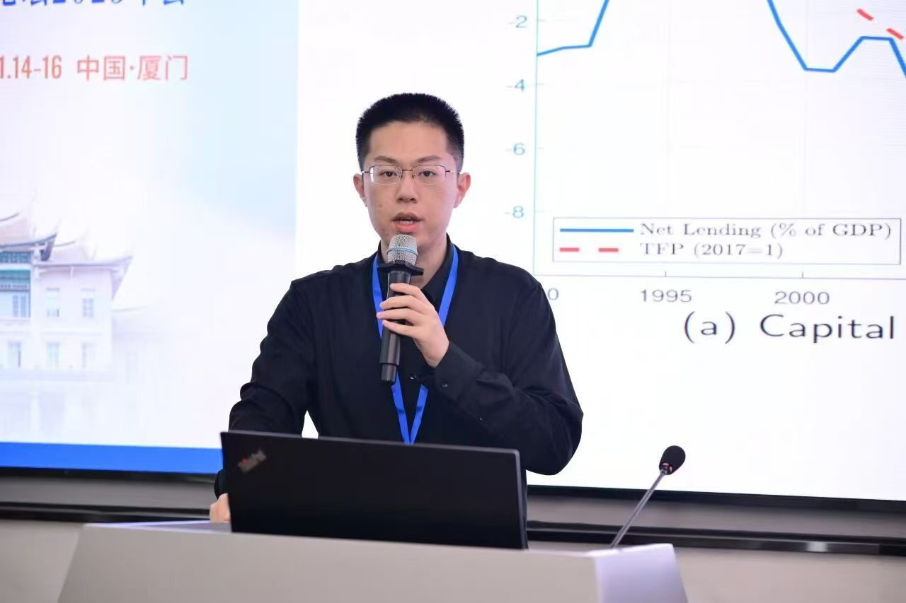

::::: hero-grid
::: hero-photo
{.profile-photo}
:::

::: hero-text
# Haoning Sun

**Ph.D. Candidate in Economics**\
School of Economics and Management, Tsinghua University

I am a Ph.D. candidate in Economics at Tsinghua University. My research interests include **macroeconomics**, **artificial intelligence and the digital economy**, **asset bubbles**, **production networks**, and the **green transition**.

**I will be on the 2026-2027 job market.**

[Email](mailto:sunhn22@mails.tsinghua.edu.cn){.btn .btn-primary} [简历](files/CV_HN_CN.pdf){.btn .btn-outline-primary} [CV](files/CV_HN_EN.pdf){.btn .btn-outline-primary}[Research Statement](files/Research_Statement_Haoning_Sun.pdf){.btn .btn-outline-primary}
:::
:::::

## Job Market Paper

### Common AI Information and Capital Allocation

This paper studies how common reliance on AI-generated financial information affects information aggregation and real capital allocation. Institutional managers with greater common reliance on AI-extractable information subsequently hold more similar portfolios, while endogenous reliance on a shared AI signal can make aggregate productivity respond non-monotonically to lower AI costs and greater model accuracy.

<details class="abstract-details">

<summary>Full abstract</summary>

This paper studies how AI progress affects capital allocation through financial information aggregation. Using institutional portfolio holdings, we document that manager pairs with greater common alignment with AI-extractable information subsequently hold more similar portfolios. Motivated by this evidence, we develop a model in which investors choose the quantity and composition of private and AI information, and firms learn from equilibrium asset prices before investing. A shared AI model error survives aggregation and enters prices, and investors may underestimate the overlap between AI information and prices. AI progress therefore changes both investors' information precision and prices' exposure to common errors. Cheaper access initially raises aggregate productivity when high costs keep AI use negligible, but further cost reductions can reverse the gain as AI research displaces private research. Improvements from very low model accuracy can instead lower productivity when increased reliance raises common-error exposure more than informed trading reduces noise-trader contamination. Numerical equilibria trace a J-shaped relationship between model accuracy and TFP. These results show how AI progress can expand investors' information acquisition while reducing the information prices convey to firms, worsening capital allocation even when firms use prices optimally.

</details>

[Paper](files/JMP_202610.pdf){.btn .btn-primary} [SSRN](https://papers.ssrn.com/sol3/papers.cfm?abstract_id=7558538){.btn .btn-outline-primary}

[View all research →](research.qmd){.more-link}

```{=html}
<!-- Add links once the files / public URLs are ready, for example:
[Paper](files/JMP.pdf){.btn .btn-primary}
[SSRN](https://ssrn.com/abstract=XXXXXXXX){.btn .btn-outline-primary}
[Slides](files/JMP_slides.pdf){.btn .btn-outline-primary}
-->
```

## Contact

School of Economics and Management\
Tsinghua University\
Beijing, China

[Email: sunhn22\@mails.tsinghua.edu.cn](mailto:sunhn22@mails.tsinghua.edu.cn)